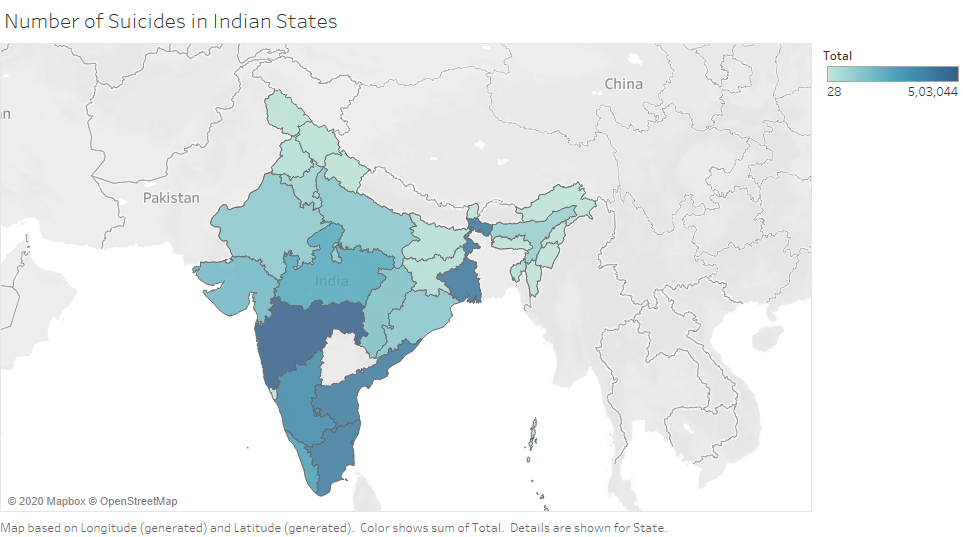

# Suicide Analysis

This project analyses Suicide dataset of Indian states for year 2001-2012. The data has been collected from Kaggle.com. Data science steps followed in this project are Data Pre-processing, Exploratory Data Analysis, Data Modelling and Prediction.

**Python Libraries used**

1. NumPy
2. Pandas
3. Matplotib
4. Seaborn
5. OS

**Pre-processing operations**

1. Checking for missing values in dataset
2. Remove the records which has values 0-100+ in the age group column which would make the dataset unclear for analysis
3. Remove the records where cause type of the suicide is 'Illegitimate Pregnancy' for 'Male'
4. Remove the records which doesn't specify any cause for suicide attempt
5. Remove the records which doesn't specify any profession of the victim
6. Remove the records where profession is 'Housewife' for 'Male'
7. The dataset consists of records with age group as 60+, which isn't appropriate. Therefore, those are replaced with random values between 60 and 100

**Exploratory Data Analysis**

1. Number of people who committed suicide between 2001-2012
2. Which year had recorded highest number of suicides?
3. Which gender tends to commit more suicide?
4. In which state do people tend to commit more suicide?
5. Top 5 states that recorded highest number of suicides
6. State that recorded highest suicide cases due to unemployment
7. Distribution of male and female suicides amongst different age groups
8. Means adopted to commit suicide
9. Major reasons for suicide attempt
10. Major reasons where suicide rate of female is more than male

***Data Source*** : Kaggle.com

***Tableau*** was used to plot a heat-map on a geographical map of India. Cleaned data set was taken after pre-processing part and that was used in Tableau.

